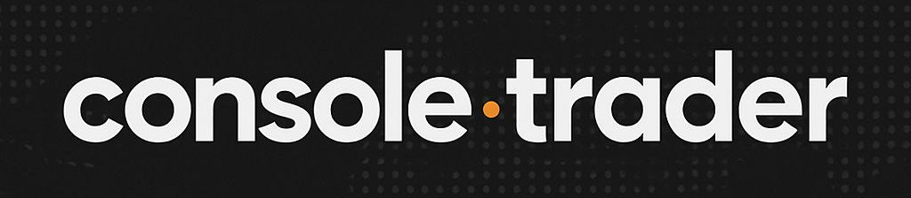

<a id="readme-top"></a>

<!-- PROJECT LOGO -->
<br />
<div align="center">
  <a href="https://github.com/Haifisch92/CapitalCli/blob/main/images/console-trader.jpg">
    
  </a>

  <h3 align="center">Capital.com CLI</h3>

  <p align="center">
    Trading from command line using Capital.com API
    <br>
    <strong>Disclaimer:</strong> this software is indipendent and not affiliated with capital.com
  </p>
</div>


<!-- TABLE OF CONTENTS -->
<details>
  <summary>Table of Contents</summary>
  <ol>
    <li>
      <a href="#about-the-project">About The Project</a>
      <ul>
        <li><a href="#built-with">Built With</a></li>
      </ul>
    </li>
    <li>
      <a href="#getting-started">Getting Started</a>
      <ul>
        <li><a href="#prerequisites">Prerequisites</a></li>
        <li><a href="#installation">Installation</a></li>
      </ul>
    </li>
    <li><a href="#roadmap">Roadmap</a></li>
    <li><a href="#contact">Contact</a></li>
  </ol>
</details>


<!-- ABOUT THE PROJECT -->
## About The Project

Market CLI Tool
This command-line interface (CLI) application allows users to interact with financial markets directly from the terminal. The tool is designed for simplicity and speed, making it ideal for traders or developers who prefer working in a console environment.
Key Features:
Watchlist View:
Monitor a customizable list of selected market instruments (e.g., stocks, cryptocurrencies, forex) in real time. The CLI displays current prices, percentage changes, and other relevant metrics.
Order History:
View a detailed log of past orders, including timestamps, order types (buy/sell), execution prices, and quantities. This helps users keep track of their trading activity over time.
Market Orders:
Place instant buy or sell orders directly from the command line. The tool supports quick execution at the best available market price, with parameters like quantity and instrument easily configurable via flags or prompts.
<p align="right">(<a href="#readme-top">back to top</a>)</p>


### Built With

* [![Python][Python.com]][Python-url]

<p align="right">(<a href="#readme-top">back to top</a>)</p>


<!-- GETTING STARTED -->

## Getting Started

This is an example of how you may give instructions on setting up your project locally.
To get a local copy up and running follow these simple example steps.

### Prerequisites

This project use uv packets manager, install with curl
   ```sh
   curl -LsSf https://astral.sh/uv/install.sh | sh
   ```
or with wget
   ```sh
   wget -qO- https://astral.sh/uv/install.sh | sh
   ```

Get API Key from [capital.com](https://capital.com)

### Installation

_Once uv is installed on your computer, it will handle the dependencies and the virtual environment automatically._

1. Clone the repo
   ```sh
   git clone https://github.com/Haifisch92/console-trader.git
   ```
2. Start project and create virtual environment
   ```sh
   uv run main.py
   ```

<p align="right">(<a href="#objectmotionnotify">back to top</a>)</p>


<!-- ROADMAP -->
## Roadmap

- [ ] Market watch
- [ ] See history order
- [ ] Place order

See the [open issues](https://github.com/Haifisch92/CapitalCli/issues) for a full list of proposed features (and known issues).

<p align="right">(<a href="#readme-top">back to top</a>)</p>


<!-- CONTACT -->
## Contact

Aiello Gabriel - [Twitter](https://twitter.com/haifisch_92) - devgabriel92@gmail.com
Project Link: [Capital.com CLI](https://github.com/Haifisch92/CapitalCli)

<p align="right">(<a href="#readme-top">back to top</a>)</p>


<!-- MARKDOWN LINKS & IMAGES -->
<!-- https://www.markdownguide.org/basic-syntax/#reference-style-links -->

[product-screenshot]: images/screenshot.png

[Python.com]: https://img.shields.io/badge/python-3670A0?style=for-the-badge&logo=python&logoColor=white
[Python-url]: https://www.python.org/ 


